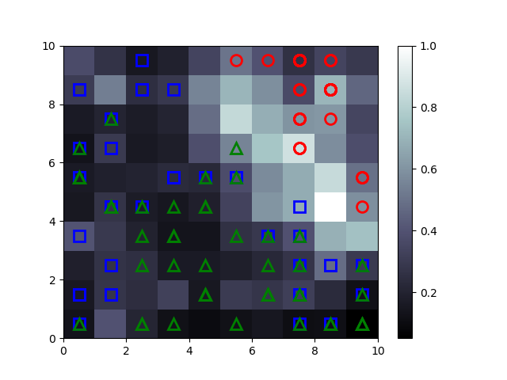

# building-som

Self Organizing Maps

## Sobre
Clusteriza três tipos de espécies do gênero Iris(é um género de plantas com flor). 

Em termos mais simples, as partes mais escuras representam aglomerados, enquanto as partes mais claras representam a divisão dos aglomerados. 

Se a distância média for alta, os pesos ao redor serão muito diferentes e uma cor clara será atribuída à localização do peso. Se a distância média for baixa, é atribuída uma cor mais escura. Os mapas resultantes mostram que a concentração de diferentes grupos de espécies é mais predominante em três zonas.

## Resultados

* (Círculo vermelho , Iris-setosa), (Triângulo verde, Iris-versicolor) , (Quadrado azul, Iris-virginica)

## Referências

<https://towardsdatascience.com/self-organizing-maps-ff5853a118d4?gi=305c64351c9>
